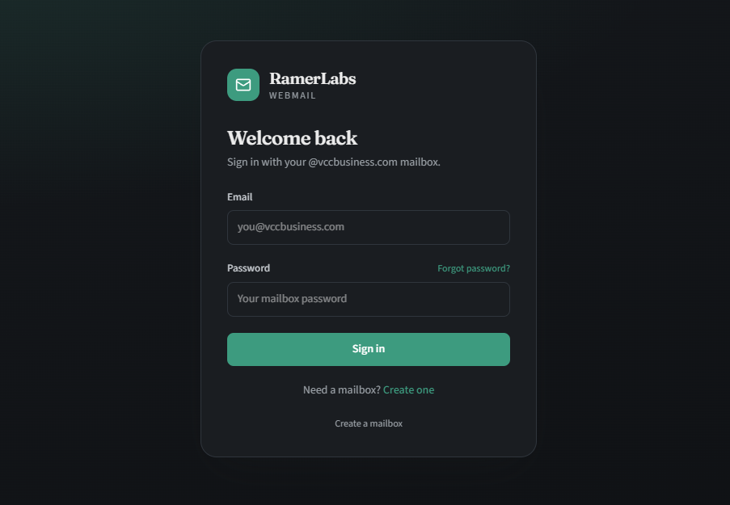

# RamerLabs Webmail Pro

A licensed Next.js (App Router) webmail product for your domain — Roundcube-style mail plus contacts, calendar, todos, notes, trading journal, expenses, and an admin console.



## License

This is a **RamerLabs licensed product**. After purchase:

1. Deploy the app (Vercel or Node host)
2. Open `/admin/login`
3. Sign in with the default installer account: **`admin` / `admin123`** (change immediately)
4. Open **License**, paste your key, and activate
5. Open **Install settings** and enter mail/cPanel/IMAP/SMTP/captcha/Redis values (no `.env` editing required for most hosts)

Support: [support@ramerlabs.com](mailto:support@ramerlabs.com) · [ramerlabs.com](https://ramerlabs.com)

## Features

### Mail
- **Secure signup** — Captcha-protected signup creates a real mailbox via cPanel (`username@MAIL_DOMAIN`)
- **Sign-in** — IMAP-verified login with encrypted iron-session cookies
- **Inbox & folders** — Browse Inbox, Sent, Drafts, Trash, Junk, and Archive
- **Read & compose** — Three-pane UI with search, threading option, reply/forward, and attachments
- **SMTP send** — Send mail through your cPanel SMTP account with proper headers

### Productivity
- **Contacts** — Personal address book with name, email, phone, organization, and description notes
- **Calendar** — Personal events synced to your account
- **To-do** — Checklist with High / Medium / Low priority, select + mass delete, and clear completed
- **Notes** — Private notes with list + editor
- **Trading Journal** — Log trades with P&L stats
- **Expenses** — Track spending by category with a currency selector

### Security & admin
- **Installer admin** — `/admin/login` with default `admin` / `admin123` on new installs
- **License key** — Activate / check / deactivate from Admin → License
- **Install settings UI** — Mail domain, cPanel, IMAP/SMTP, captcha, Upstash Redis, and more (replaces most `.env` editing)
- **Recovery email** — Required on signup; used for password reset links
- **2FA (TOTP)** — Authenticator app + backup codes
- **Admin dashboard** — Storage, mailboxes, ads, signup gate, email blocklist
- **Lacidaweb ads** — Optional sponsored slot in the message reader

Personal data persists in **Upstash Redis** on Vercel (local `.data/` fallback in development).

## Quick start

```bash
npm install
npm run dev
```

Open [http://localhost:3000/admin/login](http://localhost:3000/admin/login) and sign in with `admin` / `admin123`.

Optional: copy `.env.local.example` to `.env.local` if you prefer env-based defaults (Admin → Install settings overrides/persists them). On Vercel, set **Upstash Redis** URL + token in the host environment so settings and license state survive deploys.

---

## Changing the mail domain

Set **Mail domain** (and matching IMAP/SMTP/cPanel hosts) under **Admin → Install settings**, or set `MAIL_DOMAIN` in the environment.

### 1. Pick the domain that already has mail on cPanel

That domain must already:

- Be added in cPanel (or as an addon / parked domain with mail)
- Have working **MX** records pointing at your host
- Allow creating mailboxes via UAPI for that domain

### 2. Configure in Admin (or `.env.local`)

```env
MAIL_DOMAIN=example.com
CPANEL_HOST=mail.example.com
IMAP_HOST=mail.example.com
SMTP_HOST=mail.example.com
DAV_SERVER_URL=https://mail.example.com:2080
SYSTEM_MAIL_EMAIL=noreply@example.com
SYSTEM_MAIL_PASSWORD=...
```

Keep `CPANEL_USERNAME` as your **cPanel account username** (not an email). The API token must be allowed to manage email on that domain.

### 3. Update Vercel (production)

1. Vercel project → **Settings** → **Environment Variables**
2. Set the same keys as above for **Production** (and Preview if you use it)
3. **Redeploy** — env changes do not apply to an already-running deployment until you redeploy

After redeploy, signup should show:

> Provision a real **@example.com** address…

and new accounts will be created as `username@example.com`.

### 4. Checklist

| Item | Notes |
| --- | --- |
| `MAIL_DOMAIN` | Controls signup suffix + mailbox provisioning domain |
| `IMAP_HOST` / `SMTP_HOST` | Must accept login for `@MAIL_DOMAIN` addresses |
| `CPANEL_HOST` + token | Must be able to run `Email::add_pop` for that domain |
| Captcha site keys | Allowed hostnames should include your Vercel URL |
| DNS | MX / SPF / DKIM / DMARC for deliverability |
| Existing mailboxes | Changing `MAIL_DOMAIN` does **not** migrate old `@old-domain` accounts; users still sign in with their full email |

### Common mistakes

- Changing only the text in the UI — **don’t**; use `MAIL_DOMAIN`
- Setting `MAIL_DOMAIN=example.com` but leaving `IMAP_HOST=mail.vccbusiness.com` — login/send will fail for the new domain
- Using the email address as `CPANEL_USERNAME` — use the short cPanel account name
- Forgetting to redeploy Vercel after editing env vars

---

## Environment variables

Most settings can be managed in **Admin → Install settings**. Optional env defaults live in [`.env.local.example`](.env.local.example).

On Vercel, set `UPSTASH_REDIS_REST_URL` and `UPSTASH_REDIS_REST_TOKEN` in the host environment so license state and install settings persist. Other values can be filled after login at `/admin/login`.

| Group | Purpose |
| --- | --- |
| `SESSION_SECRET` | iron-session seal key (≥ 32 chars; auto-generated locally if unset) |
| `MAIL_DOMAIN` | Domain shown on signup and used for new mailboxes |
| `ADMIN_EMAILS` | Optional comma-separated mailbox emails allowed into `/admin` |
| `CPANEL_*` | Host, username, API token, quota for signup |
| `IMAP_*` / `SMTP_*` | Mail server hosts & ports |
| `SYSTEM_MAIL_*` | Mailbox used to send password-reset emails |
| `UPSTASH_REDIS_*` | Persistence for auth, apps, license, and install settings |
| `CAPTCHA_*` / Turnstile keys | Bot protection on signup |

Generate a session secret:

```bash
openssl rand -hex 32
```

### cPanel API token

1. Log into cPanel → **Security** → **Manage API Tokens**
2. Create a token with permission to manage email accounts
3. Put the token in `CPANEL_API_TOKEN` and your cPanel username in `CPANEL_USERNAME`

## Captcha (required for signup)

Signup creates real cPanel mailboxes, so bot protection is **fail-closed**:

1. Create a [Cloudflare Turnstile](https://dash.cloudflare.com/?to=/:account/turnstile) site (or Google reCAPTCHA v2)
2. Set in `.env.local` / Vercel:

```env
CAPTCHA_PROVIDER=turnstile
NEXT_PUBLIC_TURNSTILE_SITE_KEY=...
TURNSTILE_SECRET_KEY=...
```

3. The signup button stays disabled until the widget succeeds
4. `POST /api/auth/signup` verifies the token with Cloudflare/Google **before** calling `Email::add_pop`
5. Extra: 5 signups / 15 minutes per IP

`CAPTCHA_PROVIDER=none` is rejected unless `ALLOW_INSECURE_SIGNUP=true` **and** `NODE_ENV=development`.

## Architecture

```
src/
  app/
    api/auth/*       → signup, login, 2FA, forgot/reset/change password
    api/mail/*       → fetch, send, draft, actions, quota
    api/contacts     → personal contacts (Redis)
    api/calendar     → personal calendar (Redis)
    api/todos|notes|trades|expenses → productivity apps (Redis)
    api/admin/*      → admin stats + settings (ads, signup, email blocklist)
    mail|contacts|calendar|todos|notes|trades|expenses|settings|admin
  lib/
    cpanel.ts auth-store.ts contacts-store.ts calendar-store.ts
    trading-journal-store.ts expenses-store.ts todos-store.ts notes-store.ts
    admin-settings.ts imap.ts smtp.ts
  components/
    mail/ webmail-shell.tsx trades/ expenses/ todos/ admin/ …
```

## Deploy on Vercel

1. Push this repo and import it in Vercel
2. Add all `.env.local` variables as Project Environment Variables
3. Deploy

**Note:** Outbound connections from Vercel to IMAP/SMTP/cPanel (ports 993/465/2083) must be allowed by your host. Some shared hosts restrict remote IMAP/SMTP — enable remote access / allowlist Vercel egress if needed.

## Security notes

- Mailbox passwords live only in the sealed iron-session cookie (never in localStorage)
- Captcha is required on signup when configured
- Never commit `.env.local` or cPanel tokens
- On Vercel, set Upstash Redis for recovery email / 2FA persistence
